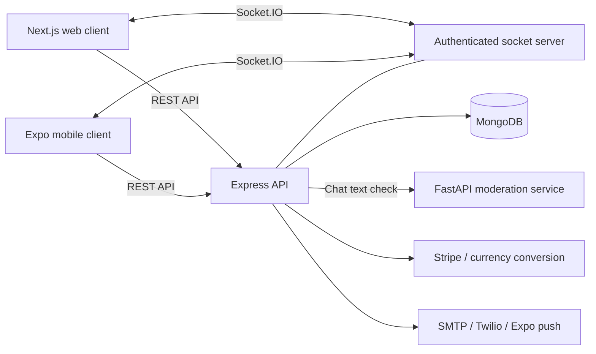

# Auto Parts Providers

### A full-stack, multi-vendor auto-parts marketplace for web and mobile

Auto Parts Providers is a final-year project that connects vehicle owners with auto-parts sellers. Buyers can find parts by vehicle, purchase listed products, or request a hard-to-find part and compare seller quotes. Sellers can manage their storefront, inventory, orders, staff, and sales through dedicated dashboards.

The repository brings together a **Next.js web application**, an **Expo / React Native mobile application**, a shared **Express / MongoDB backend**, and a **Python chat-moderation service**. Its domain includes Pakistani vehicle data, CNIC-based seller registration, local bank-account details, and PKR payment conversion.

## The problem it addresses

Finding the right replacement part involves more than searching a product name: buyers need to identify their vehicle's make, model, variant, and year, find a seller, agree on a price, and handle delivery and after-sales support. This project brings those steps into one marketplace, with both catalog shopping and a request-and-quote path for parts that are difficult to source.

## Main features

| Area | Capabilities represented in the project |
| --- | --- |
| Buyer experience | Vehicle and category filters, product details and reviews, wishlists, cart, saved addresses, promo codes, checkout, order history, and cancellation requests |
| Request a part | Requests with vehicle details and photos, seller engagement, competing offers, offer acceptance, and purchase of quoted parts |
| Seller workspace | Store onboarding and customization, product creation and editing, stock management, active/draft/deleted product states, and product restoration |
| Store operations | Order processing, sales reports, best-selling products, profit insights, review replies, and store-manager accounts assigned to a seller |
| Communication | Request-specific buyer/seller chat, image messages, unread-message counts, Socket.IO events, support conversations, and notifications |
| After-sales workflows | Return requests, seller decisions, bank details for refunds, warranty claims, and claim status/tracking screens |
| Payments and withdrawals | Stripe payment/setup intents, saved payment methods, cash-on-delivery handling, seller balances, withdrawal requests, and withdrawal receipts |
| Administration | Mobile SuperAdmin screens for orders, part requests, request chats, support queries, returns, and withdrawal processing |

Feature coverage differs between the web and mobile clients. The mobile app includes dedicated administration and warranty screens; the web app focuses on storefront shopping and buyer/seller dashboards.

## A representative user journey

1. A buyer selects a vehicle and browses compatible listings.
2. If the required part is unavailable, they submit a request with its description and photos.
3. Sellers express interest, discuss the request in seller-specific conversations, and submit offers.
4. The buyer accepts an offer and proceeds to checkout.
5. The seller processes the order, while the buyer follows its status and can initiate eligible return or warranty workflows.

## What this project demonstrates

- **Full-stack delivery:** separate web and mobile clients consuming a shared TypeScript API and MongoDB data model.
- **Domain modeling:** relationships between users, stores, vehicle data, products, requests, offers, orders, returns, warranty claims, and withdrawals.
- **Role-aware workflows:** buyer, seller, store-manager, and administrator behavior, with managers operating against their assigned seller's store.
- **Business logic beyond CRUD:** accepted quotes connected to purchasing, product snapshots in order items, order status transitions, sales aggregations, and after-sales decisions.
- **Service integration:** Stripe, Google authentication, email/SMS utilities, Expo push notifications, and real-time messaging.
- **Cross-language integration:** an Express chat controller calling a separate FastAPI moderation service before storing text messages.

These are examples of the engineering scope visible in the repository; they do not imply production certification, measured scale, or individual authorship of every component.

## Technology stack

| Layer | Technologies |
| --- | --- |
| Web | Next.js 15, React 19, TypeScript, Tailwind CSS 4, NextAuth, Radix UI, Recharts, Framer Motion |
| Mobile | Expo SDK 54, React Native 0.81, TypeScript, Expo Router, React Navigation, Stripe React Native, Expo Notifications |
| API | Node.js, Express 5, TypeScript, Mongoose, JWT, bcrypt, Multer, Socket.IO |
| Database | MongoDB |
| Moderation | Python, FastAPI, Uvicorn, regular-expression rules |
| External integrations | Stripe, Google OAuth, Nodemailer/SMTP, Twilio, Expo Push Service, CurrencyFreaks |

## Architecture



The API separates routes, controllers, Mongoose models, authentication middleware, and shared utilities. It serves uploaded media through `/uploads` and shared product images through `/images`. The web client uses NextAuth sessions and backend JWTs; the mobile API helper attaches bearer tokens and normalizes image URLs.

Chat moderation is **rule-based**, with English and Roman Urdu patterns for phone numbers, email addresses, links, social handles, locations, and sensitive identifiers. The current chat integration allows messages through when the moderation service fails.

## Repository structure

```text
.
├── web/                     # Next.js storefront and buyer/seller dashboards
│   ├── app/                 # Pages, components, contexts, and NextAuth route
│   ├── actions/             # Server actions for products, orders, and requests
│   └── lib/                 # Shared web helpers
├── mobile/                  # Expo application
│   ├── app/                 # Buyer, seller, manager, and admin screens
│   ├── components/          # Reusable UI components
│   ├── hooks/               # Notifications, wishlist, and other client hooks
│   └── utils/api/           # API client and domain-specific API wrappers
├── backend/
│   ├── src/                 # Express server, routes, controllers, models, utilities
│   ├── moderation/          # FastAPI service and moderation rules
│   ├── scripts/             # Data import and demo account/order scripts
│   └── data/                # Vehicle/category datasets and sample product data
└── README.md
```

## Local development

Use a Node.js version compatible with Next.js 15 and Expo SDK 54, npm, and a running MongoDB instance. Python 3.10+ is recommended for the moderation service. Native mobile builds also require Android Studio or Xcode and the appropriate SDKs.

Each application has its own dependencies and commands; there is no root workspace start command.

### 1. Backend

```bash
cd backend
npm install
cp .env.example .env
```

Configure `backend/.env`:

```dotenv
PORT=4001
MONGO_URI=mongodb://127.0.0.1:27017/autopartsprovider
JWT_SECRET=replace-with-a-long-random-secret
FRONTEND_BASE_URL=http://localhost:3000
CORS_ORIGINS=http://localhost:3000,http://localhost:19006,exp://localhost:19000
MODERATION_SERVICE_URL=http://127.0.0.1:8000
STRIPE_SECRET_KEY=your-stripe-test-secret-key
STRIPE_PUBLISHABLE_KEY=your-stripe-test-publishable-key
```

The supplied example contains additional settings for SMTP, social login, Twilio, and currency conversion. Configure the integrations needed for your demonstration and add any actual browser origin to `CORS_ORIGINS`.

```bash
npm run dev
```

With the configuration above, the API is available at `http://localhost:4001/api` after MongoDB connects. See the setup caveats below before attempting a fresh installation.

### 2. Web application

```bash
cd web
npm install
```

Create `web/.env.local`:

```dotenv
BACKEND_API_URL=http://localhost:4001
NEXT_PUBLIC_BACKEND_API_URL=http://localhost:4001
NEXTAUTH_URL=http://localhost:3000
NEXTAUTH_SECRET=replace-with-a-long-random-secret
GOOGLE_CLIENT_ID=your-google-web-client-id
GOOGLE_CLIENT_SECRET=your-google-web-client-secret
NEXT_PUBLIC_STRIPE_PUBLISHABLE_KEY=your-stripe-test-publishable-key
```

The two main backend URL variables use the server origin **without `/api`**. Some password-reset and vehicle-request code uses a separate `NEXT_PUBLIC_API_URL` with inconsistent expectations about that suffix; those paths need URL normalization before a complete demo.

```bash
npm run dev
```

Open `http://localhost:3000`. Google login requires matching OAuth credentials on both the web application and backend.

### 3. Mobile application

```bash
cd mobile
npm install
cp .env.example .env
```

Set `EXPO_PUBLIC_API_URL` to the backend URL **including `/api`**. For a physical device, use your computer's reachable LAN address, such as `http://192.168.1.10:4001/api`, with both devices on the same network. Configure the public Google client IDs and Stripe publishable key for those integrations.

```bash
npm start
```

The project includes native libraries such as Stripe and Google Sign-In, so use a development build for the full mobile experience:

```bash
npm run android
# On macOS with Xcode:
npm run ios
```

OAuth identifiers, signing settings, and EAS ownership in `mobile/app.json` belong to the existing project configuration and must be adapted for your own native builds. Keep secrets on the server; `EXPO_PUBLIC_*` values are included in the client bundle.

### 4. Chat-moderation service

In a separate terminal, from the repository root:

```bash
cd backend/moderation
python3 -m venv .venv
source .venv/bin/activate
pip install -r requirements.txt
python main.py
```

On Windows, activate the virtual environment with `.venv\Scripts\activate`. The service listens on port `8000`, exposes `/health`, and provides interactive API documentation at `http://localhost:8000/docs`.

### Reference and demo data

Vehicle and category datasets are provided in `backend/data`, with import scripts in `backend/scripts`. Sample documents and additional seed scripts live in `backend/src/db/seed`. Inspect a script's database connection and write behavior before running it against a disposable demo database; several scripts use fixed records or credentials, and not all load `.env` automatically.

## Suggested employer walkthrough

1. Explore the storefront and vehicle/category filtering.
2. Show a buyer submitting a part request and receiving seller offers.
3. Demonstrate chat, offer acceptance, and the resulting purchase flow.
4. Open the seller dashboard to show product management, orders, reports, and manager delegation.
5. Demonstrate a return or warranty claim and the mobile administrator views.

Useful starting points for code review are [the API entry point](backend/src/server.ts), [order logic](backend/src/controllers/orderController.ts), [offer logic](backend/src/controllers/offerController.ts), [manager-to-seller scoping](backend/src/utils/sellerHelper.ts), [the mobile API client](mobile/utils/api/client.ts), and [the moderation engine](backend/moderation/moderation_engine.py).

## Current status and setup caveats

This repository is an academic portfolio project with substantial implemented workflows. The README is based on source inspection; a complete running deployment and all user journeys have not been verified as part of this documentation update.

- The backend chat controller imports `axios`, but `backend/package.json` does not declare it directly. A fresh backend installation needs that dependency corrected.
- The legacy `/payment-sheet` handler initializes Stripe with a publishable key. Server-side Stripe operations require a secret key; that handler needs correction before use. The `/api/payments` controller separately uses `STRIPE_SECRET_KEY`.
- Some screens contain demo data or unfinished integration work. Web/mobile feature parity and end-to-end payment, refund, and notification behavior need validation with configured services.
- Automated verification is incomplete: the backend test command is a placeholder, the mobile package includes Jest configuration, and the moderation folder contains a manual test script. A passing project-wide test suite is not claimed.

Further implementation notes are available in [the moderation service documentation](backend/moderation/README.md), [moderation setup](MODERATION_SETUP.md), and [store-manager implementation notes](STORE_MANAGER_IMPLEMENTATION_COMPLETE.md).
